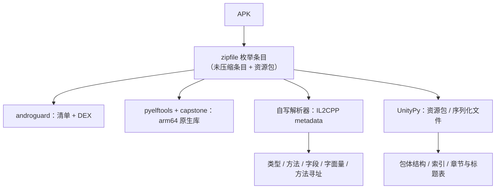
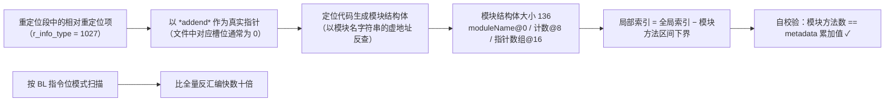
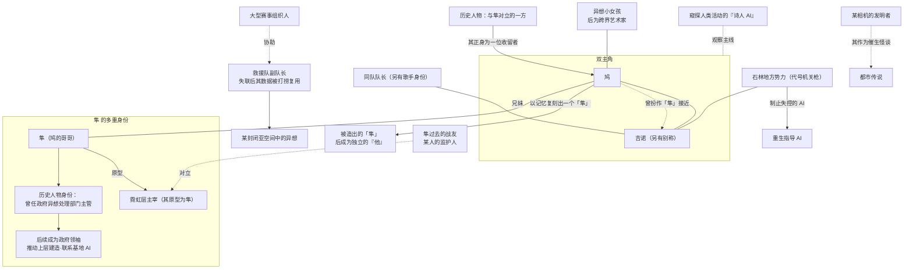

# Phigros 4.0.0 包结构逆向研究笔记（非官方 · 学习用途）

> ⚠️ **本笔记不包含、也不提供任何《Phigros》游戏资源文件、音乐、音频、曲绘、插画、谱面、
> 界面素材或程序本体；不提供破解、解密工具与任何通行密钥。**
> 全文只描述**结构、文件组织与方法学**，不附带可由他人直接复用的资源提取产物。
>
> **两条容易混淆的边界，请先分清**：
>
> 1. **「未公开 / 剧透」**——本笔记讨论的游戏机制均为**官方已在游戏内实装、玩家可正常接触**的内容，
>    因此这里**不存在“泄露未发布内容”的问题**（仅有剧透提示）。
> 2. **「资源文件与版权」**——这才是真正的红线：**即使某内容在游戏内能正常获得，
>    它的原始资源文件依然不能被提取、复制、上传或传播。** 本笔记严格遵守这条。

---

## 声明

> 本项目为非官方玩家项目，与南京鸽游网络有限公司及《Phigros》官方不存在授权、合作或运营关系。

- 本笔记为**个人学习与研究性质**：不收费、不设付费功能或会员权益、不做广告变现、不做商业导流、不接受以商业回报为条件的任何合作。
- 本笔记**不代表**鸽游或任何第三方权利人的立场、许可或背书；对同人活动的一般性开放态度不等于授权。
- 《Phigros》中的音乐、音效、曲绘及其他内容，其著作权等权利由**各自创作者、厂牌、发行方或其他权利人**享有；本笔记不涉及、也不主张对上述内容的任何权利。
- 下文涉及的曲名、曲师等**仅作为说明性引用与权利归属标注**，不构成对相关作品的再许可。
- **剧透提示**：本笔记包含对游戏剧情与游戏内彩蛋机制的概括性讨论，请酌情阅读。
- 本笔记**不主张发现、获取或曝光任何未公开内容**：下文讨论的游戏机制均为**官方已实装、
  玩家可在游戏内正常接触**的内容；同时**不附带任何游戏资源文件**（两条边界的区别见 §一）。

---

## AI 使用声明

本笔记的写作过程使用了 **AI（大语言模型 / 代码助手）辅助**，包括脚本编写、文字组织与结论整理。

- **选题、目标设定、原始分析数据的获取（解包与解析）与最终结论的核对均由人类作者完成**；
  AI 负责生成与整理脚本文稿、草稿文本与图示。
- 文中技术结论均来自**可复核的本地分析记录**（脚本输出与报告文件），关键处标有来源与偏移。
- **AI 生成内容可能存在错误、过时或不准确之处**；请以官方公开资料与自行验证的结果为准。
- AI 参与**不改变责任归属**：本文一切内容的责任由发布者承担。
- 本文不代表任何 AI 服务提供方的立场，也与其无关。
- 若发现事实性错误，欢迎指出，将及时修订。

---

## 一、本文的边界（我做了什么 / 没做什么）

### 做过的（只描述，不附带产物）

- 解析 APK 的**文件组织**：清单、资源索引、打包形态。
- 解析 Unity **IL2CPP metadata**（版本、结构体布局、统计量）。
- 还原 IL2CPP **方法指针寻址原理**（用于理解代码组织方式）。
- 归纳**章节与楼层的结构关系**（来自游戏内的章节/标题表，属索引信息）。
- 概括**剧情与人物关系**（基于游戏内已公开呈现的剧情文本，做二级概述）。

### 未做、也不在本文中的

| 项 | 说明 |
|---|---|
| 游戏资源文件 | 不提供、不附带、不外链任何资源文件本身 |
| 音乐 / 音频 | 未导出、未提供、未展示 |
| 曲绘 / 插画 / 界面素材 | **本文不含任何图片**；不提供提取产物 |
| 谱面数据 | 未提供、未展示 |
| 游戏程序本体 | 不重新打包、不提供下载 |
| 未公开 / 未发布内容 | **本笔记不涉及此类内容**：所讨论的机制均为官方已实装、玩家可在游戏内接触的内容（见下方说明） |
| 破解 / 解密工具与密钥 | **不提供**；不给出可直接复用的算法参数与密钥 |
| 官方服务器与接口 | 未接入、未调用、未干扰 |

### 关于“加密内容”的两条边界（重要）

本项目在第九章发现了一组**加密资源包**。经核对，它**不是**“泄露出来的未发布内容”，
而是**官方设计的游戏内机制**（官方给出线索、由玩家自行找出通行密钥后解锁）。由此要分清两件事：

| 维度 | 结论 | 对本笔记的影响 |
|---|---|---|
| **是不是“未公开数据”** | **不是**。该机制与其奖励内容都属于官方实装、玩家可在游戏内正常获得的内容 | 可以**讨论其结构与存在性**，不属于泄露 |
| **是不是可以自由传播的资源** | **不是**。这些内容依然是**游戏原始资源文件**（音频、谱面、图像、界面素材） | **一律不提供、不展示、不附带提取产物** |

> 一句话：**“玩家在游戏里能看到” ≠ “我可以传播文件”。**
> 前者决定它算不算“未公开”，后者决定它能不能被复制分发——本笔记只在**结构描述**层面讨论它。

#### 加密机制的**结构性**结论（不含任何可用参数）

- 资源索引中存在该项目的**自定义资源提供器**，说明官方在标准加载流程之外扩展了一套自定义加载逻辑；
- 对应的资源包为**加密形态**（自定义容器头、尺寸对齐、首字节非标准资源包头）
  ——**未提供通行密钥时无法加载**；
- 密码输入界面、拒绝提示文案与相关解锁标志位均在包内，构成一条**完整的游戏内流程**；
- 本笔记**不给出**密钥派生方式、算法参数、密钥本身，也不提供任何解密工具或脚本。

> 可公开表述的仅限于：**“本作存在这样一个由加密资源包构成的游戏内机制”**这一结构性结论。

本文涉及的曲名、资源路径等**索引性信息**仅用于解释目录结构；这些信息不代表任何人可以自由提取或再传播对应内容。

---

## 二、技术环境与工具链

| 项 | 说明 |
|---|---|
| 目标形态 | Unity 构建的 APK（arm64-v8a / armeabi-v7a） |
| 引擎与脚本后端 | Unity + IL2CPP（metadata 版本 31） |
| 使用的公开工具库 | `androguard`、`pyelftools`、`capstone`、`UnityPy` |
| 环境约束 | 仅用 PyPI 获取依赖；全程以脚本方式产出文本化报告，便于复核 |



---

## 三、IL2CPP 逆向方法论（核心，可复用）

### 3.1 metadata 结构体大小（用精确整除验证）

```
Il2CppTypeDefinition    88 B  (16×u32/i32 + 8×u16 + 2×u32)
Il2CppMethodDefinition  36 B  (7×u32 + 4×u16)
Il2CppImageDefinition   40 B  (10×u32)
Il2CppFieldDefinition   12 B  (nameIndex, typeIndex, token)
Il2CppFieldDefaultValue 12 B  (fieldIndex, typeIndex, dataIndex)
```

已知易错点：`Il2CppTypeDefinition` 的 `field_count` 位于 **offset 68**（66 为 `property_count`）。

### 3.2 方法指针寻址原理



> 另一处易错点：字符串字面量表**按字母序排列**，不能靠"相邻字面量"推测上下文。

---

## 四、包体结构与配置（仅索引层）

- 打包形态：Unity 序列化数据文件（场景/共享资源/流式资源）+ 资源包目录。
- 资源索引：Addressables 的 catalog 以 JSON + 若干二进制块的形式存放；
  其中包含**自定义的资源提供器**条目（说明该项目在标准提供器之外扩展了自定义加载逻辑）。
- 上述自定义提供器对应的是一组**加密资源包**，二者共同构成一条**官方设计的游戏内解锁流程**
  （详细边界见 §一“关于加密内容的两条边界”）。
- 权限极简（仅网络相关），说明玩法本体离线，联网仅用于云存档与账号登录。
- 存档使用分层加密，密钥为程序内常量（**本文不给出密钥内容**）。

---

## 五、章节 ↔ 楼层 的结构关系


- 每个章节在数据侧对应一个**章节区块**，含标题/副标题的本地化键与章节封面条目。
- 一个易被误解的规律：**章节区块的末项常是上一章的终曲**（由"上一章已通关"标志位控制），
  因此"区块末项"不等于"本章曲目"。

---

## 六、剧情与人物关系（概述级）

> 本节为**二级概述**，不复制游戏内文本；引用的专有名词仅用于指代。

### 6.1 人物关系总图



**易混点（本笔记校对过的三处）**

1. 主角吉诺的别称 **不是** 另一位同音角色的名字——两者是不同人物。
2. 历史人物与其"正身"是**同一存在的多个称名**，不是多个人。
3. 某位角色有**三个称名**（同一存在的多面）。
4. 官方把「鸠 / 隼」并为**同一个条目**，那是"以这一对为叙事单位"，
   **不等于两人是同一个人**；游戏内文本明确写为兄妹关系。

### 6.2 主题脉络

- 世界观的核心设定是"**一个被倒回去过的世界**"：造出共享意识世界的同时，
  把世界的时间倒退到某个过去年份，用以逆推已失去的文明。
- 由此衍生出贯穿全作的母题：**记忆、回溯、以及"归零"**。
- 终局锚点是"**边界抵达穹顶**"——穹顶碎裂、个人重新成为心灵上的孤岛。

---

## 七、我刻意没做的（合规红线）

依据《Phigros》同人创作及第三方项目规范（2026 版），以下事项**本笔记均未涉及**：

| 规范关注点 | 本笔记的处理 |
|---|---|
| 资源文件 / 音乐 / 曲绘 / 界面素材的提取、复制、上传、公开传播、重新打包、分发 | **未提供、未展示、未附带**任何此类产物 |
| 第三方素材（音乐、曲绘等）的使用 | 不涉及；已注明权利归各自权利人 |
| 资源文件（**含游戏内可正常获得的加密玩法奖励内容**） | **不提供、不展示、不附带**任何提取产物——“可正常获得”不等于“可传播文件” |
| 未公开 / 未发布数据 | 本笔记所讨论的机制均为官方已实装内容，**不涉及未公开数据**（仅按剧透处理） |
| 绕过技术保护措施、破解、反编译 | 不提供工具、不给出可直接复用的参数与密钥 |
| 官方服务器 / 账号 / 排行榜等网络服务 | 未接入、未调用、未干扰 |
| 冒充官方、造成来源混淆 | 已按要求在显著位置标注非官方并附声明 |
| 商业经营性质活动 | 非商业；不收费、不变现、不导流 |

---

## 八、依据规范删除的内容（透明化说明）

为符合规范，以下内容已从可发布版本中**整体移除**，仅在本地保留、不上传：

1. **全部图片素材**：包括章节曲目横幅、收藏品插画、界面图与背景图等（属游戏美术/界面素材）。
2. **全部音频**：包括音乐与音效文件。
3. **谱面数据**：完整谱面文件及其统计结论。
4. **加密资源包的任何产物**：解密后的资源包、导出资源、以及相关参数
   ——即便该内容属游戏内可正常获得的机制，提取产物仍属资源文件。
5. **通行密钥本身**，以及给出密钥的具体来源路径与可复现步骤。
6. **"绕过保护"的可复用实现**：派生密钥的算法参数、解密脚本。
7. **游戏资源文件的任何产物**：即便某些内容（如第九章密码玩法的奖励资源）玩家可在游戏内正常获得，
   提取产物**仍属资源文件**，一律不展示、不附带。
8. **游戏本体与其重新打包产物**。

保留的内容限于：**文件组织与结构描述、IL2CPP 方法学、章节/楼层结构关系、
剧情与人物关系的二级概述、加密机制的结构性结论（不含任何参数与密钥）、以及自绘的关系图**。

---

## 九、权利归属与鸣谢

- 《Phigros》的名称、标识、程序、文字与美术等权利归**南京鸽游网络有限公司**所有。
- 游戏内音乐、音效、曲绘及其他内容的相关权利，归**各自创作者、音乐厂牌、发行方或其他权利人**所有。
- 本笔记仅在"为说明研究对象"的范围内作描述性引用；如任何权利人认为本文内容不妥，
  请联系发布者，将**立即删除**相关内容。
- 感谢开发团队与各位曲师、插画师、剧情作者的作品。

---

## 十、待解问题（不含敏感值）

1. 章节收藏品表中存在**一个数字型解锁条件**，其语义未明——本文不列出该值。
2. 章节区块末尾的“复现条目”模式是否在所有章节一致，可进一步核对。
3. 资源索引中若干条目的用途仍不明——本文不展开。
4. 该加密机制在主线资源中只留下“外壳”（解锁流程与标志位），实际内容由加密包另行加载；
   两者如何衔接仅能间接推断，本文不作展开。

---

*本笔记为个人学习研究记录，非官方资料；不构成对任何内容的使用许可。*
